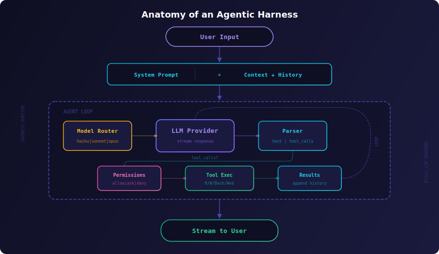

  

  
  
  
  

  <strong>The model isn't the moat — the system is.</strong>

---

The same LLM produces wildly different results depending on the harness wrapping it. A well-designed agentic harness turns a language model into a software engineer. A bad one turns it into an expensive autocomplete.

This repo documents what makes the difference — distilled from studying 25+ production agent harnesses, 20+ research papers, and building harnesses from scratch.

## Start Here

| If you want to... | Go to... |
|-------------------|----------|
| Understand what a harness is | [Anatomy Overview](docs/01-anatomy-of-an-agent-harness.md) |
| **Build your own harness** | [Build Your First Harness](docs/build-your-first-harness.md) |
| Pick the right harness for your use case | [Which Harness?](references/use-case-guide.md) |
| Compare harnesses side by side | [Harness Matrix](references/harness-matrix.md) (25+ harnesses) |
| Read the best articles and papers | [Reading List](references/reading-list.md) (20+ papers, 10+ articles) |
| See how top harnesses solve hard problems | [Case Studies](case-studies/) (5 deep dives) |
| Learn the terminology | [Glossary](docs/glossary.md) |
| See how we got here | [Timeline](docs/timeline.md) (2022-2026) |

## What Is an Agentic Harness?

An agentic harness is the system that sits between a language model and the real world. It manages the conversation loop, provides tools, handles errors, routes to the right model, enforces permissions, and presents results to the user.

  

Think of it like a race car: the engine (LLM) matters, but the chassis, suspension, tires, and driver (harness) determine whether you win.

## The 10 Core Components

| # | Component | Doc | One-liner |
|---|-----------|-----|-----------|
| 0 | [Anatomy Overview](docs/01-anatomy-of-an-agent-harness.md) | What makes a harness vs just an LLM wrapper |
| 1 | [Agent Loop](docs/02-the-agent-loop.md) | The core observe-choose-act cycle every harness implements |
| 2 | [Tool System](docs/03-tool-system.md) | Schema design, execution, sandboxing — the #1 lever after the model |
| 3 | [Context Management](docs/04-context-management.md) | History compaction, repo maps, codebase indexing |
| 4 | [Model Routing](docs/05-model-routing.md) | Use the right model for each turn — save 50-80% on costs |
| 5 | [Provider Abstraction](docs/06-provider-abstraction.md) | Normalize OpenAI, Anthropic, local models behind one interface |
| 6 | [Error Recovery](docs/07-error-recovery.md) | Retry, self-correction, lint gates — agents fail constantly |
| 7 | [Security & Permissions](docs/08-security-and-permissions.md) | Allowlists, hooks, sandboxed execution |
| 8 | [TUI & UX](docs/09-tui-and-ux.md) | Streaming, progress, trust signals — UX determines autonomy |
| 9 | [Eval & Benchmarks](docs/10-eval-and-benchmarks.md) | Task suites, metrics, measuring harness vs model quality |
| 10 | [Lessons from the Field](docs/11-lessons-from-the-field.md) | What works, what doesn't, what's next |

## Advanced Topics

| Topic | Doc | Why It Matters |
|-------|-----|---------------|
| [MCP: Model Context Protocol](docs/12-mcp-model-context-protocol.md) | The open standard turning tools into a plugin ecosystem |
| [Background & Async Agents](docs/13-background-async-agents.md) | Agents that run for hours without supervision |
| [Multi-Agent Orchestration](docs/14-multi-agent-orchestration.md) | DAGs, orchestrator-workers, and when to split agents |
| [Voice Agent Harnesses](docs/15-voice-agent-harnesses.md) | Sub-300ms latency loops for speech-first agents |

## Which Harness?

Different harnesses excel at different tasks — just like models. Here's the quick version:

| Use Case | Best Fit | Why |
|----------|----------|-----|
| Solo dev, terminal | Claude Code, Aider | Best agent loops for interactive terminal use |
| Solo dev, IDE | Cursor, Windsurf, Continue | Deep editor integration, codebase indexing |
| Autonomous tasks | Devin, Copilot Workspace | Background execution, async PR delivery |
| Untrusted code | OpenHands, Codex CLI | Docker / OS-level sandboxing |
| Plugin extensibility | Goose | MCP-native, all capabilities as plugins |
| Build your own | Agent SDK, SWE-agent | Libraries/frameworks for custom harnesses |
| Local/private models | Aider, Continue, Goose | First-class Ollama/vLLM support |
| Generate full apps | Bolt, Replit Agent, v0, Lovable | Prompt-to-app in the browser |

Full guide with decision flowchart and constraint filtering: **[Use Case Guide](references/use-case-guide.md)**

## Case Studies

Deep dives into specific architectural decisions:

| Case Study | Harness | Focus |
|------------|---------|-------|
| [Sub-Agent Patterns](case-studies/claude-code-sub-agent-patterns.md) | Claude Code | Bounded child agents with restricted tool access |
| [ACI Design](case-studies/swe-agent-aci-design.md) | SWE-agent | Why tool interface design beats tool quantity |
| [OS-Native Sandboxing](case-studies/openai-codex-sandboxing.md) | Codex CLI | Kernel-level isolation vs Docker vs permissions |
| [Repo Map](case-studies/aider-repo-map.md) | Aider | Tree-sitter codebase summaries for token efficiency |
| [Codebase Indexing](case-studies/cursor-codebase-indexing.md) | Cursor | Embeddings + structural indexing for IDE agents |

## Reading List Highlights

**Papers:**
- [ReAct: Synergizing Reasoning and Acting](https://arxiv.org/abs/2210.03629) — the loop behind every agent
- [SWE-agent: Agent-Computer Interfaces](https://arxiv.org/abs/2405.15793) — tool design > tool count
- [SWE-bench](https://arxiv.org/abs/2310.06770) — the benchmark that started it all
- [MemGPT: LLMs as Operating Systems](https://arxiv.org/abs/2310.08560) — OS-inspired memory management
- [Lost in the Middle](https://arxiv.org/abs/2307.03172) — why context placement matters

**Articles:**
- [Components of a Coding Agent](https://magazine.sebastianraschka.com/p/components-of-a-coding-agent) — Sebastian Raschka
- [Building Effective Agents](https://www.anthropic.com/engineering/building-effective-agents) — Anthropic
- [How We Built Codex](https://openai.com/index/building-codex/) — OpenAI
- [The Shift from Models to Systems](https://simonwillison.net/2024/Dec/19/the-shift-from-models-to-systems/) — Simon Willison

Full list with 20+ papers, 10+ articles, frameworks, repos, and community resources: **[Reading List](references/reading-list.md)**

## Harnesses Covered

We track **25+ production harnesses** across five categories:

| Category | Harnesses |
|----------|-----------|
| **Terminal** | Claude Code, Aider, Codex CLI, Goose, Mentat |
| **IDE** | Cursor, Cline, Continue, Windsurf, Roo Code, PearAI, Zed AI |
| **Autonomous** | Devin, Copilot Workspace, Bolt, Replit Agent, v0, Lovable |
| **Research** | SWE-agent, OpenHands, AutoCodeRover, Agentless |
| **Emerging** | Amp, Augment, Amazon Q, Tabnine, Cody, Aide, Void, OpenCode |

Full comparison: **[Harness Matrix](references/harness-matrix.md)** | Benchmarks: **[Task Suite](benchmarks/task-suite.md)**

## Reference

| Resource | Description |
|----------|-------------|
| [Glossary](docs/glossary.md) | 25+ terms defined — ACI, compaction, lint gate, MCP, repo map, and more |
| [Timeline](docs/timeline.md) | 2022-2026: from ChatGPT wrappers to production agent systems |
| [Build Your First Harness](docs/build-your-first-harness.md) | 200-line tutorial: agent loop + tools + streaming in TypeScript |
| [Harness Matrix](references/harness-matrix.md) | Side-by-side comparison of 25+ harnesses |
| [Benchmark Task Suite](benchmarks/task-suite.md) | 8 graded tasks for evaluating your harness |

## Contributing

We want this to be the definitive resource for agentic harness knowledge. Contributions welcome — see **[CONTRIBUTING.md](CONTRIBUTING.md)** for guidelines.

**Especially wanted:**
- New case studies (Devin autonomy, Goose MCP, Bolt WebContainers)
- Arxiv papers on agent architecture, eval, and security
- Company engineering blog posts about harness design
- Benchmark results and comparisons
- Corrections and updates as the space evolves

## License

MIT
