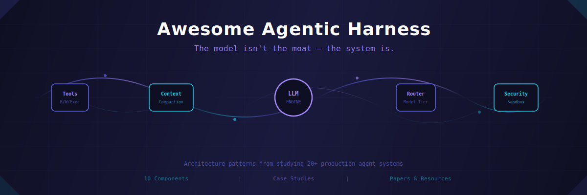

<p align="center">
  
</p>

<p align="center">
  <a href="LICENSE"></a>
  <a href="#harnesses-covered"></a>
  <a href="references/reading-list.md"></a>
  <a href="case-studies/"></a>
  <a href="references/reading-list.md#protocols--standards"></a>
</p>

<br>

> *The same LLM produces wildly different results depending on the harness wrapping it. A well-designed agentic harness turns a language model into a software engineer. A bad one turns it into an expensive autocomplete.*

<br>

This is the definitive knowledge base for **harness engineering** — the discipline of building the systems around language models that determine whether agents succeed or fail in production. Distilled from studying 45+ harnesses, 30+ research papers, and production source code.

<br>

---

<br>

## `>` Start Here

<table>
<tr><td width="50%" valign="top">

### New to harness engineering?

1. [**What is an Agentic Harness?**](docs/01-anatomy-of-an-agent-harness.md) — The 4-layer model, 10 core components, and the generator/evaluator pattern
2. [**Build Your First Harness**](docs/build-your-first-harness.md) — 200-line TypeScript tutorial: agent loop + 3 tools + streaming
3. [**Which Harness Should I Use?**](references/use-case-guide.md) — Decision flowchart for picking the right tool

</td><td width="50%" valign="top">

### Deep diving?

4. [**Claude Code Architecture Deep Dive**](case-studies/claude-code-architecture-deep-dive.md) — 5-phase loop, streaming tool executor, 7-stage permissions
5. [**Reading List**](references/reading-list.md) — 30+ papers, 20+ articles, 10 frameworks, 4 protocols
6. [**Harness Matrix**](references/harness-matrix.md) — 45+ harnesses compared side by side
7. [**Sandbox-First Harness Program**](docs/16-sandbox-first-harness-program.md) — Rebuild order, target architecture, and why the sandbox comes first

</td></tr>
</table>

<br>

---

<br>

## `>` The Four Layers

Most teams optimize layer 1 (bigger models, higher benchmarks). The teams winning invest in layers 3 and 4.

```
Layer 1: Model Weights      — frozen intelligence, the API you call
Layer 2: Context             — prompt, conversation history, retrieved documents
Layer 3: Harness             — tools, loops, error handling, the agent's designed environment
Layer 4: Infrastructure      — multi-tenancy, RBAC, resource isolation, state persistence
```

> *Princeton NLP proved it with SWE-agent: same model, better environment, 64% improvement. Terminal-Bench 2.0 confirmed it: LangChain improved 52.8% → 66.5% by changing only the harness — not the model.*

<br>

---

<br>

## `>` Implementation Workspace

The repo now includes an implementation foundation alongside the research library:

- **[Eval Lab](evals/README.md)** — canonical tasks, fixture repos, scoring rubric, and sandbox checklist
- **[Packages](packages/README.md)** — shared contracts, `sandbox-core`, `codex-core`, and placeholders for later reconstruction waves

This is the bridge from “study harnesses” to “rebuild harnesses under one roof.”

<br>

---

<br>

## `>` The 10 Core Components

<table>
<tr>
<td width="50%" valign="top">

| # | Component | Doc |
|:-:|-----------|-----|
| 0 | **[Anatomy](docs/01-anatomy-of-an-agent-harness.md)** | 4-layer model, generator/evaluator pattern |
| 1 | **[Agent Loop](docs/02-the-agent-loop.md)** | 5-phase iteration, 7-subsystem model |
| 2 | **[Tool System](docs/03-tool-system.md)** | ACI design, diff editing, MCP |
| 3 | **[Context](docs/04-context-management.md)** | 4 compaction strategies, repo maps |
| 4 | **[Model Routing](docs/05-model-routing.md)** | Per-turn routing, 50-80% cost savings |

</td>
<td width="50%" valign="top">

| # | Component | Doc |
|:-:|-----------|-----|
| 5 | **[Providers](docs/06-provider-abstraction.md)** | Universal interface, SSE streaming |
| 6 | **[Error Recovery](docs/07-error-recovery.md)** | State machine, 10 error classes |
| 7 | **[Security](docs/08-security-and-permissions.md)** | 7-stage pipeline, sandboxing |
| 8 | **[TUI & UX](docs/09-tui-and-ux.md)** | Trust signals, streaming |
| 9 | **[Eval](docs/10-eval-and-benchmarks.md)** | SWE-bench Pro, FeatureBench |

</td>
</tr>
</table>

| | Advanced Topics | |
|:-:|-----------------|---|
| 11 | **[Lessons from the Field](docs/11-lessons-from-the-field.md)** | What works, what doesn't, what's next |
| 12 | **[MCP](docs/12-mcp-model-context-protocol.md)** | The open standard turning tools into a plugin ecosystem |
| 13 | **[Background Agents](docs/13-background-async-agents.md)** | Agents that run for hours without supervision |
| 14 | **[Multi-Agent](docs/14-multi-agent-orchestration.md)** | DAGs, orchestrator-workers, and when to split agents |
| 15 | **[Voice Agents](docs/15-voice-agent-harnesses.md)** | Sub-300ms latency loops for speech-first agents |
| 16 | **[Sandbox-First Program](docs/16-sandbox-first-harness-program.md)** | Rebuild harness families in sequence and synthesize a sandbox-first architecture |

<br>

---

<br>

## `>` Case Studies

<table>
<tr>
<td width="33%" valign="top">

**[Claude Code: Full Architecture](case-studies/claude-code-architecture-deep-dive.md)**
5-phase loop, streaming tool executor, 4 compaction strategies, 7-stage permissions, 823-line retry system

**[Sub-Agent Patterns](case-studies/claude-code-sub-agent-patterns.md)**
Bounded child agents with restricted tool access and worktree isolation

</td>
<td width="33%" valign="top">

**[SWE-agent ACI Design](case-studies/swe-agent-aci-design.md)**
Why a 100-line agent with good tool interfaces beats complex orchestration

**[Aider Repo Map](case-studies/aider-repo-map.md)**
Tree-sitter codebase summaries for 10x token efficiency

</td>
<td width="33%" valign="top">

**[Codex CLI Sandboxing](case-studies/openai-codex-sandboxing.md)**
Kernel-level isolation vs Docker vs permission systems

**[Cursor Codebase Indexing](case-studies/cursor-codebase-indexing.md)**
Embeddings + structural indexing for zero-shot understanding

**[Browser Use Control Plane Sandboxing](case-studies/browser-use-control-plane-sandboxing.md)**
Why high-autonomy web agents benefit from isolating the entire agent, not just the tool

</td>
</tr>
</table>

<br>

---

<br>

## `>` Which Harness?

| Use Case | Best Fit |
|----------|----------|
| Solo dev, terminal | **Claude Code**, Aider, Gemini CLI, OpenCode |
| Solo dev, IDE | **Cursor**, Windsurf, Trae, Kiro, Continue |
| Autonomous tasks | **Devin**, Jules, Copilot Coding Agent |
| Untrusted code | **OpenHands**, Codex CLI |
| Plugin-first | **Goose** (MCP-native) |
| Build your own | **Agent SDK**, SWE-agent |
| Free terminal agent | **Gemini CLI**, Qwen Code |
| Local/private models | **Aider**, Continue, Goose, OpenCode |
| Generate full apps | **Bolt**, Replit Agent, v0, Lovable |

Full guide: **[Use Case Guide](references/use-case-guide.md)** | Compare all: **[Harness Matrix](references/harness-matrix.md)**

<br>

---

<br>

## `>` Reading List Highlights

<table>
<tr>
<td width="50%" valign="top">

**Essential Reading**
- [Harness Design for Long-Running Development](https://www.anthropic.com/engineering/harness-design-for-long-running-application-development) — Anthropic's GAN-inspired evaluator
- [Harness Engineering](https://openai.com/index/harness-engineering/) — OpenAI names the discipline
- [Building Effective Agents](https://www.anthropic.com/engineering/building-effective-agents) — The patterns guide
- [Components of a Coding Agent](https://magazine.sebastianraschka.com/p/components-of-a-coding-agent) — Raschka's 6 components

</td>
<td width="50%" valign="top">

**2026 Papers**
- [Building AI Coding Agents for the Terminal](https://arxiv.org/abs/2603.05344) — 7-subsystem harness model
- [Natural-Language Agent Harnesses](https://arxiv.org/abs/2603.25723) — Harness behavior in prose
- [Agentic Design Patterns](https://arxiv.org/abs/2601.19752) — 12 formal design patterns
- [FeatureBench](https://arxiv.org/abs/2602.10975) — SWE-bench is saturated

</td>
</tr>
</table>

Full list: **[Reading List](references/reading-list.md)** — 30+ papers, 20+ articles, 10 frameworks, 4 protocols

<br>

---

<br>

## `>` Harnesses Covered

**45+ production harnesses** across eight categories:

| Category | Harnesses |
|----------|-----------|
| **Terminal** | Claude Code, Aider, Codex CLI, Goose, Gemini CLI, OpenCode, Qwen Code, Plandex |
| **IDE** | Cursor, Windsurf, Trae, Kiro, Cline, Continue, Roo Code, Junie, Antigravity |
| **Cloud/Async** | Devin, Google Jules, Copilot Coding Agent, Warp Oz |
| **App Generators** | Bolt, Replit Agent, v0, Lovable, Copilot Workspace |
| **Research** | SWE-agent, OpenHands, mini-SWE-agent, Open-SWE, OpenDev, Live-SWE-agent |
| **Derivative** | Claw Code (110K+ stars), Roo Code, PearAI |
| **Enterprise** | Amp, Augment, Amazon Q, Tabnine, Cody |
| **Specialized** | Aide, Void, Warp 2.0, Pi Agent |

**Protocols:** [MCP](https://modelcontextprotocol.io/) &#8226; [A2A](https://a2aprotocol.ai/) &#8226; [ACP](https://zed.dev/ai) &#8226; [AGENTS.md](https://agents.md/) — governed by the [Agentic AI Foundation](https://www.linuxfoundation.org/) (AAIF)

<br>

---

<br>

## `>` Reference

| Resource | Description |
|----------|-------------|
| **[Glossary](docs/glossary.md)** | 30+ terms — ACI, compaction, NLAH, context engineering, and more |
| **[Timeline](docs/timeline.md)** | 2022-2026: from ChatGPT wrappers to harness engineering as a discipline |
| **[Build Your First Harness](docs/build-your-first-harness.md)** | 200-line TypeScript tutorial |
| **[Harness Matrix](references/harness-matrix.md)** | 45+ harnesses compared |
| **[Benchmark Task Suite](benchmarks/task-suite.md)** | 8 graded tasks for evaluating your harness |

<br>

---

<p align="center">
  <sub>MIT License</sub>
</p>
