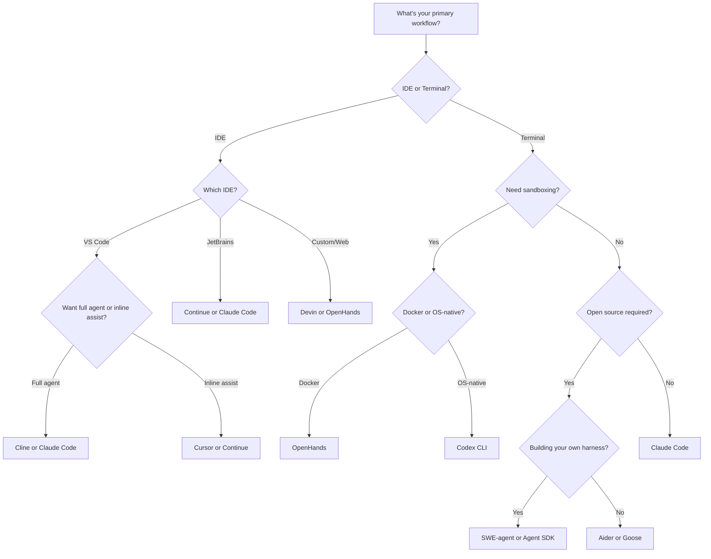

# Which Harness Should You Use?

Different harnesses excel at different tasks — just like models. Picking the right one depends on your use case, constraints, and workflow.

## Quick-Reference Matrix

| Use Case | Best Fit | Why |
|----------|----------|-----|
| **Solo dev, IDE workflow** | Cursor, Continue | Deep IDE integration, codebase indexing, inline edits |
| **Solo dev, terminal workflow** | Claude Code, Aider | Full agent loop in the terminal, git-aware |
| **Autonomous task completion** | Claude Code, Devin | Multi-turn loops, subagents, long-running sessions |
| **Research / exploration** | Claude Code, Aider | Strong context management, repo-wide understanding |
| **Open source contribution** | SWE-agent, OpenHands | Designed for issue-to-patch workflows |
| **Untrusted code execution** | OpenHands, Codex CLI | Docker/OS-level sandboxing |
| **Plugin-first extensibility** | Goose | MCP-native, all capabilities as plugins |
| **Team / CI integration** | Devin, OpenHands | Web UI, async execution, PR workflows |
| **Custom harness development** | Agent SDK, SWE-agent | Libraries/frameworks for building your own |
| **Local/private models** | Aider, Continue, Goose | Strong local model support via Ollama/vLLM |

## Decision Flowchart

## Constraint-Based Filtering

### Must be open source?
**Aider** (Apache 2.0), **OpenHands** (MIT), **SWE-agent** (MIT), **Goose** (Apache 2.0), **Codex CLI** (Apache 2.0), **Continue** (Apache 2.0)

Not open source: Claude Code (source-available), Cursor (proprietary), Devin (proprietary)

### Must run locally with no API calls?
**Aider** + Ollama, **Continue** + Ollama, **Goose** + local models

Most harnesses require cloud LLM APIs. These three have first-class local model support.

### Must support sandboxed execution?
- **OS-native sandboxing:** Codex CLI (Seatbelt on macOS, Landlock on Linux)
- **Docker sandboxing:** OpenHands
- **Cloud VM sandboxing:** Devin
- **No sandboxing:** Claude Code, Aider, Cline, Continue, Goose, Cursor (all rely on permission systems instead)

### Must support sub-agents / multi-agent patterns?
- **Yes:** Claude Code (Agent tool), Devin (agent pool), Cursor (background agents)
- **Limited:** OpenHands (micro-agents)
- **No:** Aider, SWE-agent, Cline, Goose, Continue, Codex CLI

### Need strong context management for large codebases?
- **Codebase indexing:** Cursor (embeddings + tree-sitter), Continue (@-mentions + context providers)
- **Repo maps:** Aider (tree-sitter-generated summaries)
- **Auto compaction:** Claude Code, Cline (LLM-based summarization)
- **Minimal:** SWE-agent (windowed file viewing), Codex CLI, Goose

## Use Case Deep Dives

### I want to fix bugs fast
**Best:** Claude Code or Aider

Both have strong git integration and can read, diagnose, and patch without heavy setup. Claude Code's multi-turn loop means it'll keep trying until the fix works. Aider's git-aware edits make reverting easy.

### I want to build features from specs
**Best:** Claude Code or Devin

Multi-file creation, planning, test writing, and iterative refinement. Claude Code does this interactively in the terminal. Devin does it autonomously in the cloud.

### I want to evaluate/benchmark different agents
**Best:** SWE-agent or OpenHands

Both are designed around reproducible evaluation. SWE-agent pioneered SWE-bench. OpenHands has a clean event stream for analysis.

### I want to build my own harness
**Best:** Agent SDK (for Claude) or SWE-agent (for research)

The Agent SDK gives you Claude Code's full runtime as a library. SWE-agent gives you a well-documented research framework with ACI principles.

### I want maximum privacy / air-gapped operation
**Best:** Aider + Ollama or Continue + Ollama

Full local execution, no data leaves your machine. Trade off some capability for complete privacy.

---

*This guide reflects the state of these harnesses as of early 2026. The space moves fast — see the [Reading List](./reading-list.md) for the latest.*
